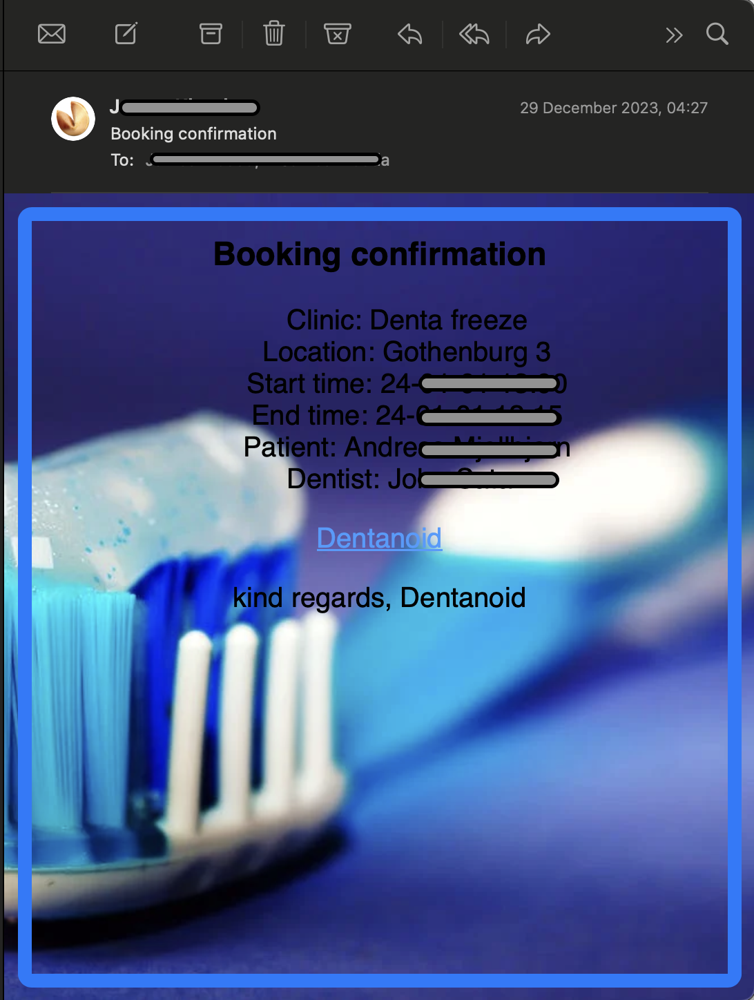

# Notification Service

> ⚠️ **Disclaimer**: This is a **fork** of [Notification Service](https://github.com/Dentanoid/Notification-Service), originally created and maintained by the [Dentanoid Organization](https://github.com/Dentanoid)


## Description
Welcome to this here Notification service! 

The purpose of this service is to serve the users of the DentaNoid dental visit booking system with emails for booking confirmations, booking cancellation and emails about newly posted timeslots.


## Visuals



## Installation
### Getting started

This service is written in NodeJS. [Check this link for more information about NodeJS.](https://nodejs.org/en).

To run this service you need to follow the steps described below:

### Installing NodeJS using BREW (if you dont have NodeJS)

If you do not have NodeJS installed on your computer you can download both brew and NodeJS with these commands:

#### Install brew
```
/bin/bash -c "$(curl -fsSL https://raw.githubusercontent.com/Homebrew/install/HEAD/install.sh)"
``````

If this command does not work, [check here](https://brew.sh/).

#### Install NodeJS with brew
```
brew install node
``````

### Add .env file (in the root folder)
The .env file contains information about the MQTT broker, your database cridentials and your email provider. This informatin is best contained locally on your computer, to keep your connections private. You will have to insert a BROKER_URL (separated in to MQTT_HOST and MQTT_PORT).

For our instances of the service, we used a [HIVE](https://www.hivemq.com/mqtt/) private broker.

```
MQTT_HOST='YOUR_HOST'
MQTT_PORT='YOUR_PORT'
MQTT_PROTOCOL='YOUR_PROTOCOL'
MQTT_USERNAME='YOUR_USERNAME'
MQTT_PASSWORD='YOUR_PASSWORD'

DB_USER='YOUR_DB_USERNAME'
DB_PASSWORD='YOUR__DB_PASSWORD'
DB_CLUSTER='YOUR_DB_CLUSTER'
DB_NAME='YOUR DB_NAME'

EMAIL_SERVICE='YOUR_EMAIL_PROVIDER'
EMAIL_USERNAME='YOUR_EMAIL'
EMAIL_PASSWORD='YOUR__EMAIL_PASSWORD'
EMAIL_FROM='YOUR_EMAIL'
EMAIL_SENDER='YOUR_EMAIL'
SMTP_HOST='YOUR_SMTP_HOST'
SMTP_PORT='YOUR_SMTP_PORT'
```

### Run Notification service
In order to build and run the Patient API you need to type these commands in to your terminal:

```
1. npm install

2. npm run dev OR npm run start
```
Congratulations! You are now running the Notification service.

## Features
### MQTT integration
The application is controlled via MQTT which allows the systems other microservices to request notifications remotely on demand!

### Dynamic emails
The application uses nodemailer to deliver emails all day everyday. Every email contains personalized information and is addressed specifically to you, the dream! Our UI staff has also made sure that all emails are styled to convey that soothing  feeling you have always wanted from a dental email.

### Subscribe to email notifications
Users can sign up for email notifications about newly published time slots clinics of their choice. Notification service contains all functionality for creating, reading, updating and deleting "subscribers' '. Once subscribed you get an email every time a dentist at your favorite clinic has a new open slot. Once you have got the time you need you can unsubscribe no hassle.

### Resilient emails
Did you not receive your highly sought after cancellation email? Fear not! Notification service runs cron jobs every 5 minutes trying to redeliver your forgotten mail. 

Why would mail not get delivered?
Because DentaNoid is a system built with a microservices architecture, Notification service is dependent on other services running to get hold of information such as which clinic your appointment is at or what username your dentist has. In the unlikely event that one of these other services experiences some downtime, Notification Service will fail to deliver your mail immediately. But with the inclusion of cron jobs Notification Service makes sure the guys with blue sabers always win by delivering your email as soon as the other services hop back online. 

## Roadmap
Notification service will be under development during December 2023 and will be realised to the public in early January 2024.

## Contributing Team

- James Klouda
- Jonatan Boman
- Mohamad Khalil
- Joel Mattsson
- Lucas Holter
- Cornelia Olofsson Larsson

## Authors and acknowledgment
Thanks to the authors and maintainers of axios, dotenv, luxon, mongodb, mongoose, mqtt, node-cron, nodemailer, nodemon and jest for providing the tools neccesary to make this project come togheter!

## License
ISC 
